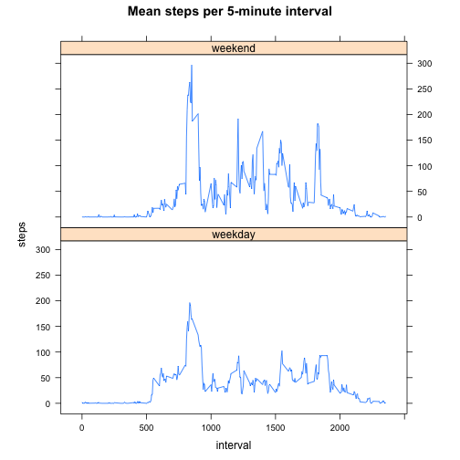

## Loading and preprocessing the data

Loading data:


```r
rawdata = read.csv("./activity.csv");
```

Processing data: Not necessary.

## What is mean total number of steps taken per day?
  
Questions:  
  
1. Calculate the total number of steps taken per day  
  

```r
numStepsPerDate = aggregate(steps ~ date, data = rawdata, sum)
```

2. Make a histogram of the total number of steps taken each day  


```r
hist(numStepsPerDate$steps,main = "Total number of steps taken each day",xlab="Steps")
```

 

3. Calculate and report the mean and median of the total number of steps taken per day  


```r
 meanSteps = as.integer(mean(numStepsPerDate$steps))
```


```r
 medianSteps= as.integer(median(numStepsPerDate$steps))
```

+ *The mean of the total number of steps taken per day is:* 10766.  

+ *The median of the total number of steps taken per day is:* 10765.  

## What is the average daily activity pattern?

Questions:


1. Make a time series plot (i.e. type = "l") of the 5-minute interval (x-axis) and the average number of steps taken, averaged across all days (y-axis)


```r
meanStepsPerInterval = aggregate(steps ~ interval, data = rawdata, mean)
plot(steps ~ interval, data = meanStepsPerInterval, type = "l")
title(main = "Mean steps per 5-minute interval")
```

 

2. Which 5-minute interval, on average across all the days in the dataset, contains the maximum number of steps?


```r
filtered = meanStepsPerInterval[which.max(meanStepsPerInterval$steps), ];
filtered$interval
```

```
## [1] 835
```


*The 5-minute interval that contains the maximum number of step, on average across all the days in the dataset is: * 835. 

## Imputing missing values

Questions:

1. Calculate and report the total number of missing values in the dataset


```r
missingvalues = sum(is.na(rawdata))
```

*The total number of missing values in the dataset is:* 2304. 

2. Devise a strategy for filling in all of the missing values in the dataset.

Strategy: Replace missing values in the column "steps" with its mean on that interval

3. Create a new dataset that is equal to the original dataset but with the missing data filled in.


```r
#Function to get the mean steps for the interval from the aggregated data in variable
#"meanStepsPerInterval"

getMeanStepsOfInterval = function(interval) {

  meanStepsPerInterval[meanStepsPerInterval$interval == interval, ]$steps
}

#For all rows in the original dataset with NA in the column "steps", replace the NA by the mean steps for the interval of the row

withoutNA = rawdata;
numNA = 0;
for (i in 1:nrow(withoutNA)) {
    if (is.na(withoutNA[i, ]$steps)) {
        numNA = numNA + 1;
        interval = withoutNA[i, ]$interval;
        
        #get the mean steps for the interval from the aggregated data in variable
        #"meanStepsPerInterval"
        withoutNA[i, ]$steps =  getMeanStepsOfInterval(interval)
    }
}
```

 2304 *missing values replaced*.

4. Make a histogram of the total number of steps taken each day and Calculate and report the mean and median total number of steps taken per day. Do these values differ from the estimates from the first part of the assignment? What is the impact of imputing missing data on the estimates of the total daily number of steps?


```r
numStepsPerDate_withoutNAs = aggregate(steps ~ date, data = withoutNA, sum)
hist(numStepsPerDate_withoutNAs$steps,main = "Total number of steps taken each day (version 2)")
```

 

## Are there differences in activity patterns between weekdays and weekends?

Questions:

1. Create a new factor variable in the dataset with two levels – “weekday” and “weekend” indicating whether a given date is a weekday or weekend day.

*The following code will install package "lubridate" if not found


```r
rawdates = as.Date(withoutNA$date);
if (!require(lubridate)){ 
  install.packages("lubridate")
  library(lubridate)
}
withoutNA$dateAsDay = factor(ifelse(wday(rawdates)%%6 == 0, "weekend", "weekday"))
```

2. Make a panel plot containing a time series plot (i.e. type = "l") of the 5-minute interval (x-axis) and the average number of steps taken, averaged across all weekday days or weekend days (y-axis). See the README file in the GitHub repository to see an example of what this plot should look like using simulated data.

*The following code will install package "lattice" if not found


```r
meanStepsPerInterval2 = aggregate(steps ~ interval + dateAsDay, data = withoutNA, mean)
if (!require(lattice)){ 
  install.packages("lattice")
  library(lattice)
}
xyplot(steps ~ interval | dateAsDay, data = meanStepsPerInterval2, type = "l",main = "Mean steps per 5-minute interval")
```

 
